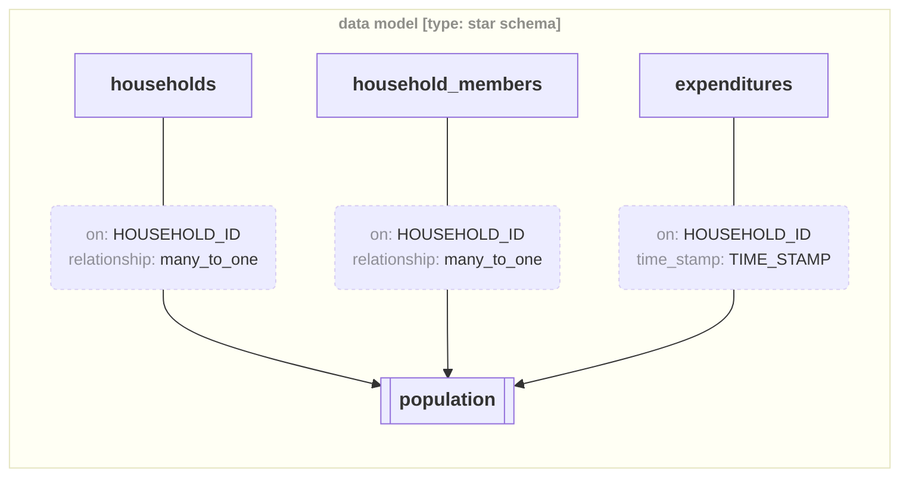
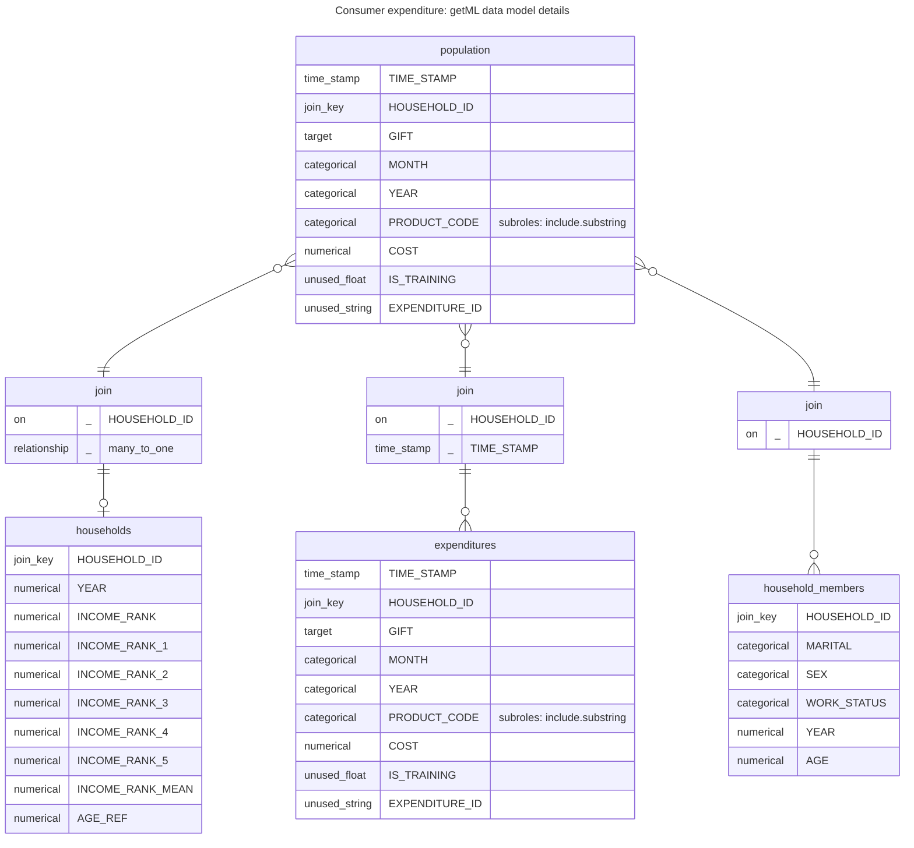

# Showcase


<style>
.md-typeset .panzoom-box {
    background-color: transparent !important;
}
.md-typeset > .panzoom-box,
.md-typeset .panzoom-box_:not(.result .panzoom-box) {
    border: .05rem solid var(--md-code-bg-color);
    border-bottom-left-radius: .1rem;
    border-bottom-right-radius: .1rem;
    border-top-width: .1rem;
}
</style>


## **Abstract Data Model**

```` markdown title="Abstract Data Model"

````

<div class="result" markdown>


</div>


## **Materialized Data Model**

```` markdown title="Abstract Data Model"

````

<div class="result" markdown>


</div>
